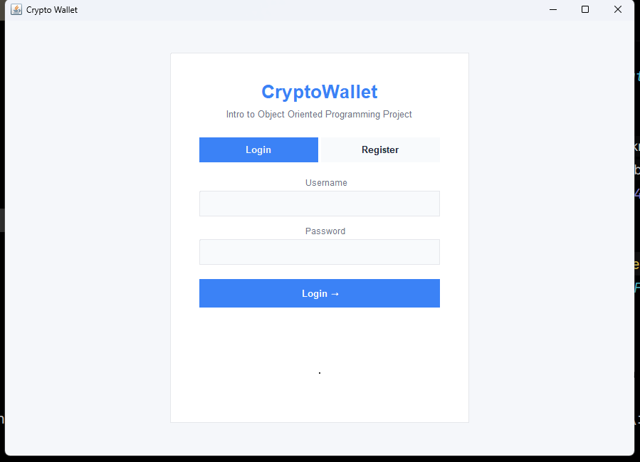
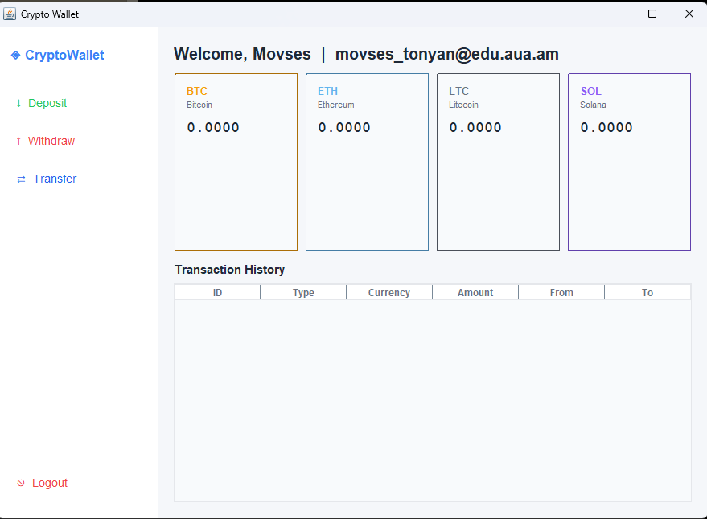
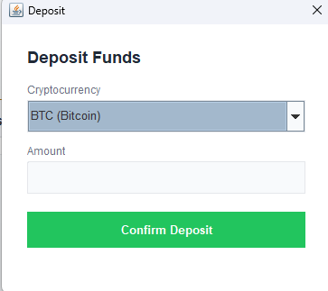
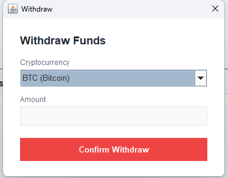
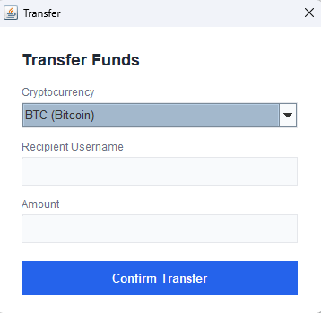

# Crypto Wallet Management System
## for Intro to Object-Oriented Programming (CS120: Section C)

A Java console application that simulates a cryptocurrency wallet management system. Users can create wallets, check balances, send and receive funds, and view transaction history.

Class design: 
```
payment_system (package)
|
| exceptions
|
        |
        | InsufficientFundsException.java
        |
        | InvalidAmountException
|
| CryptoCurrency.java
| CryptoWalletGUI.java
| Transaction.java
| TransactionType.java
| User.java
| Wallet.java
|
```
________________________

Our current progress at Week 12 includes completing the core class architecture (User, Wallet, Transaction), implementing fundamental wallet operations such as deposit, withdrawal, and transfer, and establishing a structure that supports future extensions.

________________________

Finalizing our project. Successfully completed the originally planned functionality and finalized the core implementation of the cryptocurrency wallet management system.

_____________________


# How to use our application
## Login/Page


<details>        
  <summary>This is our login page from where you can log in your account or just register new account.
For testing use our demo users with our names as a username and a very complicated password, which can you see it below (click the triangle)</summary>

*username* : Movses , *password* admin
</details>

## Main Menu


After logining in or registering new user, the user enters the main menu.
From here the user can acces to every menu from a side menu from the left. 
At the bottom we have the history of operations

## Deposit

<br>
In this menu you can deposit yourself any amount of crypto you want.

## Withdraw
## Login/Page
 
<br>
In this menu you can withdraw your balance after you deposited a tremendous amount of bitcoins. 
It is the saddest part of our project.

## Transfer Menu

<br>
In these menu the user trnasfers some *x* amount to another user. 
But there is 3 factors for the transfer : **1st**, the user should exist, **2nd** your balance should be enough, **3rd** the amount for the transfer is positive.


